# HeartSync


### Acknowledgments
HeartSync is a product of the Hack for Good initiative, inspired by Big at Heart's problem statement. We extend our gratitude to [acknowledged parties, if any] for their support and contributions.

### About
Offering customizable enrollment forms, streamlined QR attendance tracking, comprehensive reporting and more, HeartSync serves as a comprehensive solution, connecting organizations with eager volunteers and empowering kind-hearted individuals to extend a helping hand effortlessly.

### Demo Link: 
To test out our demo, here are some credentials you can use:
- Volunteer: Username: `lwj@gmail.com` | Password: `password`
- Admin: Username: `rk@gmail.com` | Password: `password`

Access our project demo [here](https://h4g.seeleng.dev)!


## Table of Contents

- [HeartSync](#heartsync)
    - [Acknowledgments](#acknowledgments)
    - [About](#about)
    - [Demo Link:](#demo-link)
  - [Table of Contents](#table-of-contents)
  - [Project Status](#project-status)
  - [Features](#features)
    - [Log in/Sign Up Page](#log-insign-up-page)
    - [Volunteer Features](#volunteer-features)
      - [Profile Page](#profile-page)
      - [Two-Factor Authentication](#two-factor-authentication)
      - [Dashboard](#dashboard)
      - [Events](#events)
      - [Personal Activity Page](#personal-activity-page)
      - [Blogs](#blogs)
    - [Admin Features](#admin-features)
      - [Volunteer List](#volunteer-list)
      - [Activity List](#activity-list)
      - [Create Enrollment Form](#create-enrollment-form)
      - [Attendance Management](#attendance-management)
      - [Organisation List](#organisation-list)
      - [Volunteer Activity Report](#volunteer-activity-report)
      - [Volunteer Demographic Report](#volunteer-demographic-report)
  - [Contributing](#contributing)
  - [Installation](#installation)
    - [Technologies](#technologies)
    - [Credits](#credits)

## Project Status
This project is currently in development. We have many features in place (see [features](#features) below for a more in-depth walk through of our product) and to come!

## Features

### Log in/Sign Up Page

Users can sign up for an account if they are using the page for the first time, or log in with their credentials if they already have an account. 


We provide 2 interfaces - one for the volunteer, another for the admin. 
- See [volunteer features](#volunteer-features)
- See [admin features](#admin-features)

### Volunteer Features
Volunteers have access to a [profile page](#profile-page), [dashboard](#dashboard), [events](#events), [personal activity page](#personal-activity-page), [blogs](#blogs). 


#### Profile Page 
This page allows volunteers to manage their personal details by
- updating basic personal information such as age, name, email, gender, date of birth, education level, immigration status, description, salutation, profile image.
- updating skills and interest by choosing from preselected lists
- updating availability such as commitment preference (Adhoc, Weekly, Monthly), vehicle ownage and exact time itervals they are free on throughout the week (split into Morning, Afternoon, Evening time slots)
Additionally, attendance for events can be taken by scanning the volunteers individual QR code found within their profile page.
- enabling Two-Factor Authentication to further protect their account. See [2-FA](#two-factor-authentication) below for more details.

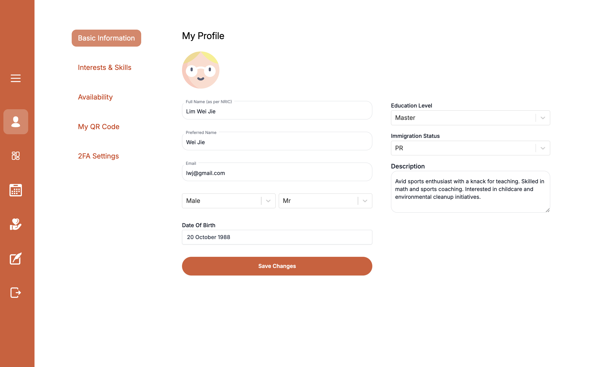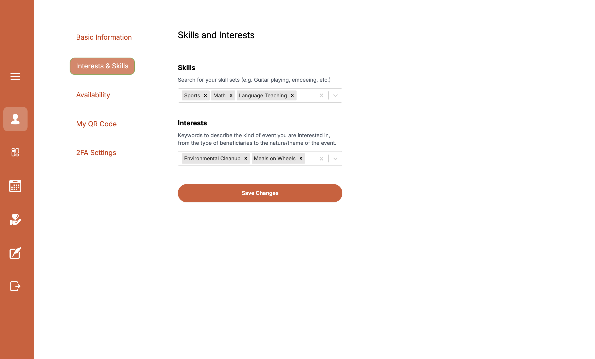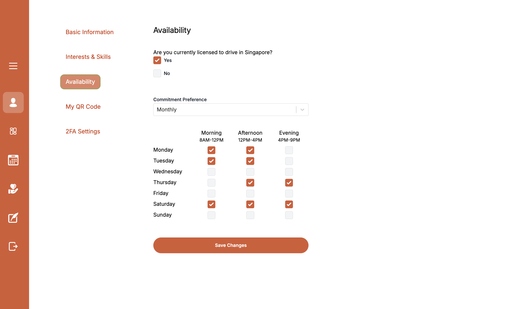

#### Two-Factor Authentication
For further security, volunteers can choose to enable 2-FA in their profile page. This will allow them to use Singpass to log in to their accounts.

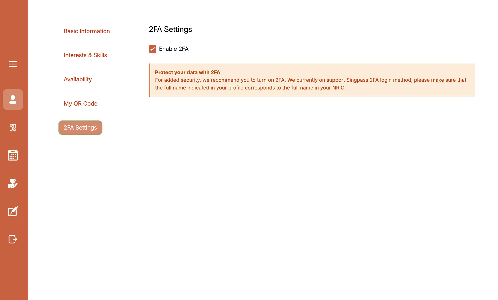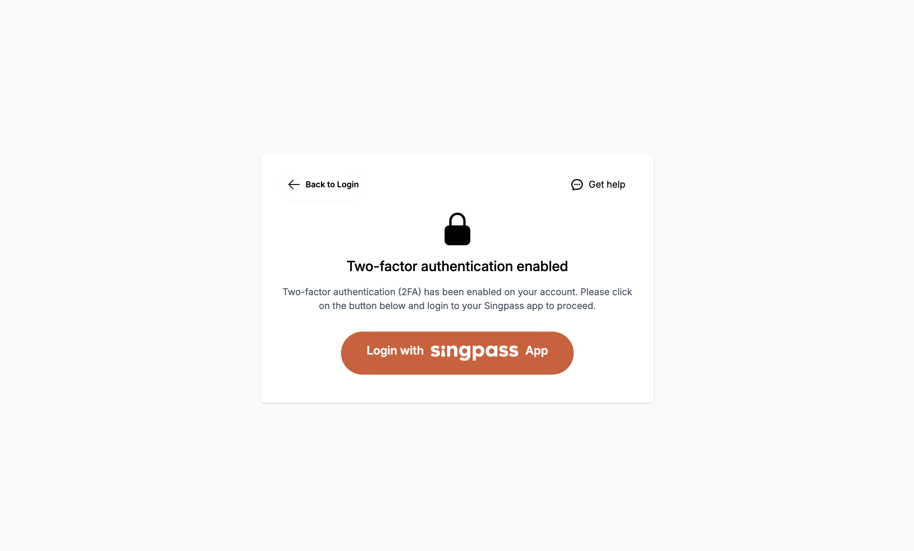


#### Dashboard
The dashboard is the page the volunteer is greeted by upon log in/ sign up. It contains a all-in-one view of
- upcoming events the user has signed up for (top left)
- activities (top right)
- blogs (bottom left)
- outstanding feedback reminders (bottom right)

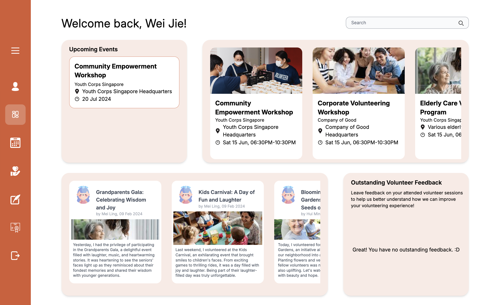

#### Events
This page allows volunteers 
- to browse events
- sign up for events. By clicking on a specific event, the volunteer will be brought to the main page of the activity containing more details on the event such as location, timing, description. From there if they can click on the `Enroll in Event` button to indicate their availability for specific timeslots. 

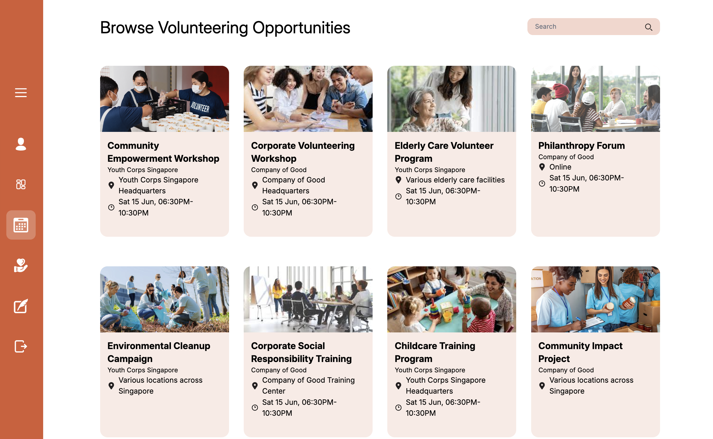

#### Personal Activity Page
This page allows users to track their events by
- viewing all of their upcoming and past events they have signed up for

Additionally, for events that they have attended, volunteers can 
  - check if they have received any feedback
  - download certificates issued to them by the organisation in charge of the event

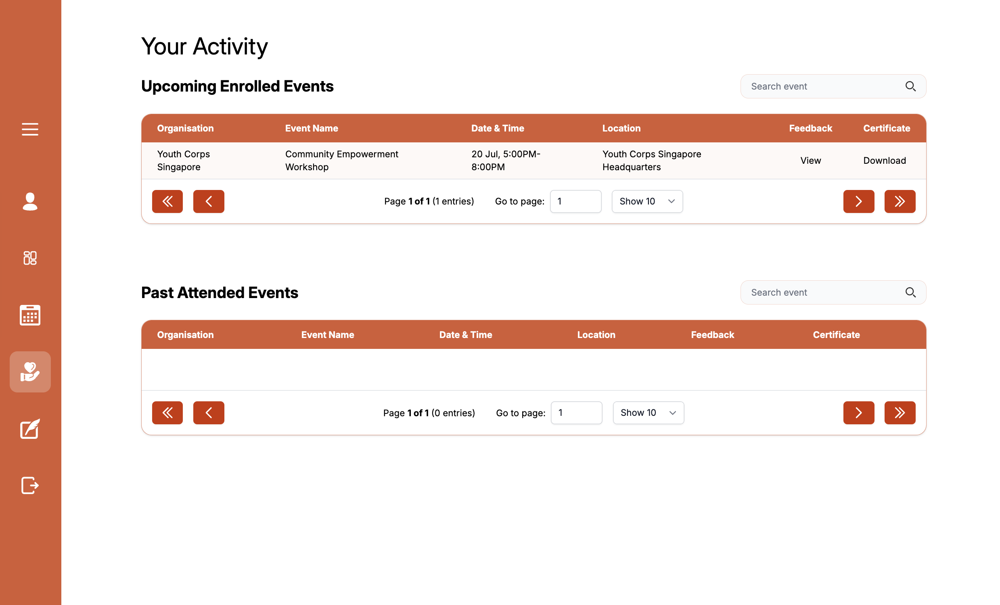

#### Blogs
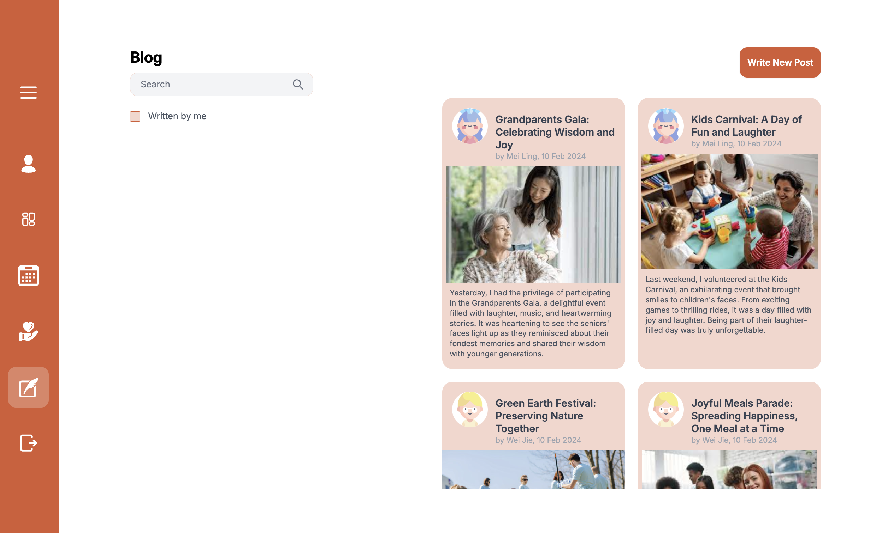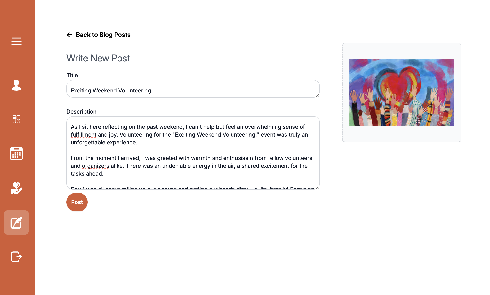
This page allows volunteers to reflect and recount on their experience and read about others journey through
- reading blogs they and other volunteers have written
- filtering blogs written by themselves
- creating, editing and deleting their blog entries

### Admin Features
Admins have access to the [volunteer list](#volunteer-list), [activity list](#activity-list), [organisation list](#organisation-list), [volunteer activity report](#volunteer-activity-report), [volunteer demographic report](#volunteer-demographic-report)


#### Volunteer List
Admins are able to manage volunteers on this page by:
-  using the search bar on the top left to look for volunteers by their name or emails
-  have a full view of all volunteers that have signed up and their emails
-  clicking on a specific volunteer to 
   -  view their profile, including events they have signed up for, attendance, skills, interests, availability etc
   -  provide feedback for a specific event by clicking on the eye icon in the feedback column

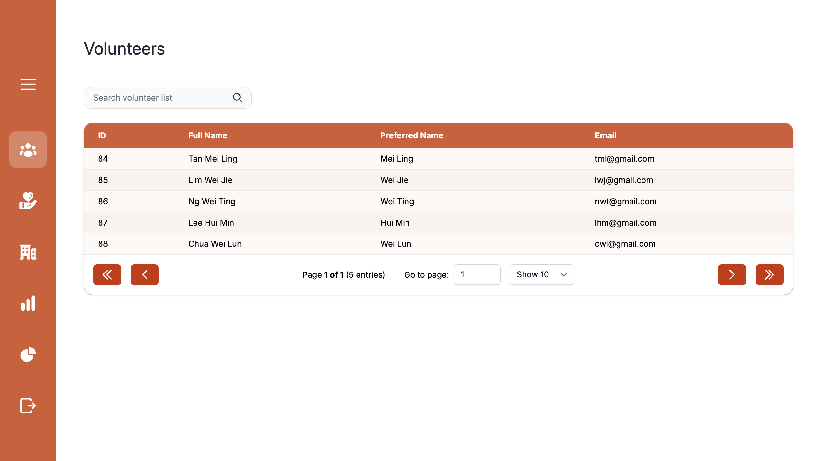
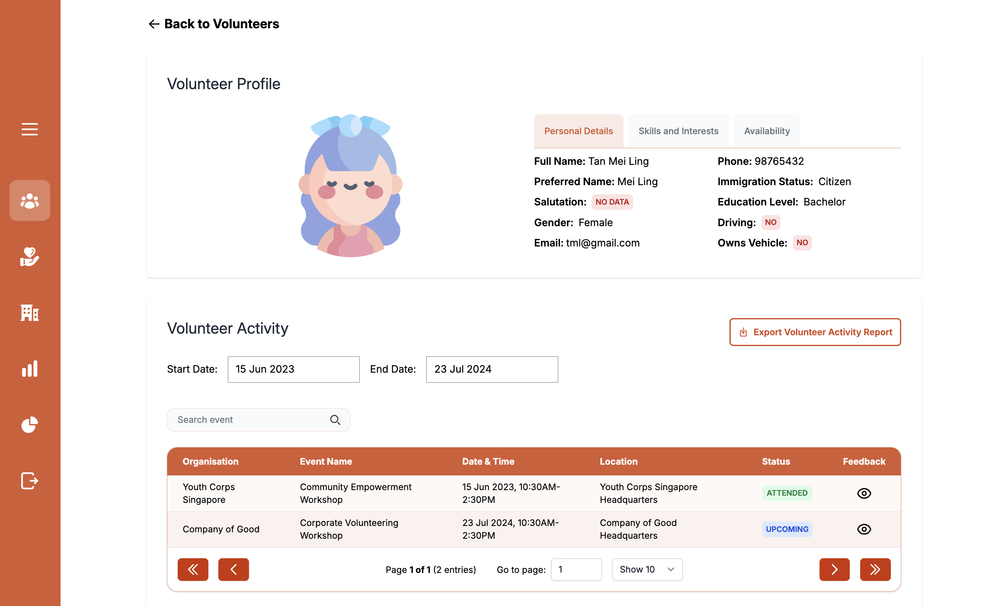


#### Activity List
Admins are able to manage activities by:
-  using the search bar on the top left to look for activities by their name
-  have a full view of all activities together with their type (Volunteering, Workshop, Training) and the organisations they fall under
-  creating new activities by clicking on the `Create` button on the top right corner. This leads them to fill in details of the activity such as name, location, session timings, description, images, capacity and type
-  clicking on a specific activity to:
   -  view details of the activity, including description, sessions 
   -  create and customise enrollment forms by clicking on the `Create Enrollment Form` button. See [Create Enrollment Form](#create-enrollment-form) for more details.
   -  edit activity details
   -  delete the activity
   -  manage attendance for a specific session. See [Attendance Taking](#attendance-management) for more details.

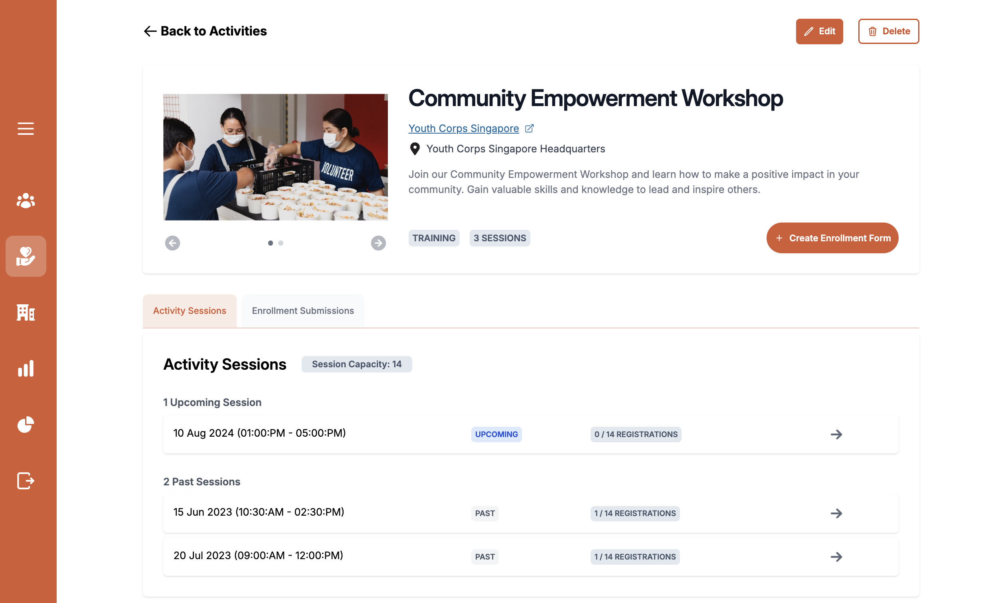

#### Create Enrollment Form
This feature falls under the activity section. Upon clicking on an activity in the activity list, the admin can click on `Create Enrollment Form` to start customising questions needed for that activity by adding as many questions as they would like by using the `Add Input` button. With this, admins can add
- Short Answer Type Questions: volunteers can submit a short piece of text
- Paragraph Type Questions: volunteers can submit a longer piece of text
- Checkbox Type Questions: admins can add a variety of options with `Add Option` where volunteers can select multiple options to submit
- Dropdown Type Questions: admins can add a variety of options with `Add Option` for volunteers to choose one to submit

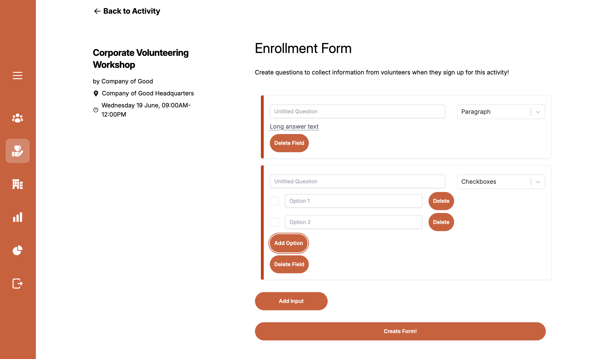


#### Attendance Management
This feature falls under the activity session. After a admin navigates to a specific activity, clicking on a specific session allows them to:
- view details of the session, including date, duration, number of registrations, capacity
- view session feedbacks and reflections
- track enrollment form submissions
- manage registrations and attendance by 
  - clicking on `Manage Attendance` to mark volunteers as attended or not attended. Clicking on `Take Attendance` further brings the admin to a QR code scaner, where they can scan the volunteers QR code with their camera to mark them as attended. Alternatively they can also use manual input to register the volunteers
  - clicking on `Generate Blank Attendance List` should they need the empty attendance sheet in excel format
  - clicking on `Export Registration/ Attendance Data` to export the records in excel format

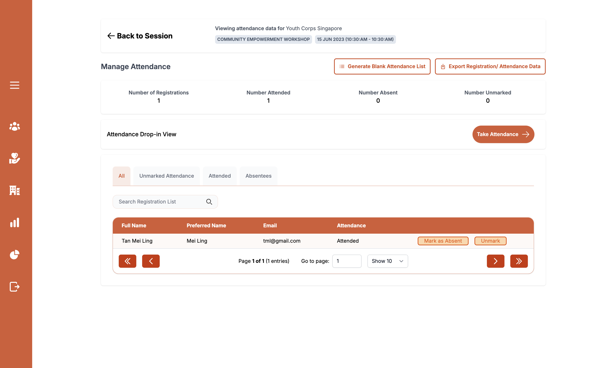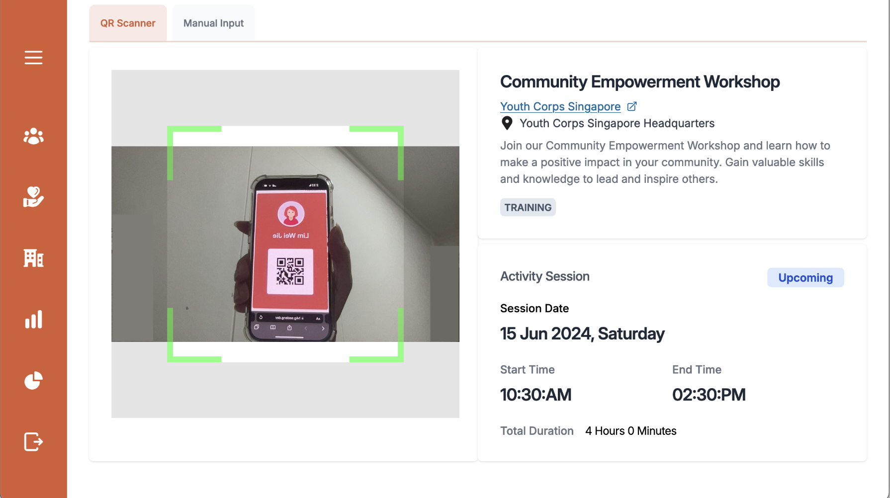


#### Organisation List
Admins are able to manage organisations by: 
-  have a full view of all organisations
-  creating new organisations by clicking on the `Create Organisation` button on the top right corner. This leads them to fill in details of the organisation such as name, description, images, tags, website url
-  clicking on a specific organisation to:
   -  edit exisiting organisations
   -  view specific organisations page containing all their details, including activities they offer

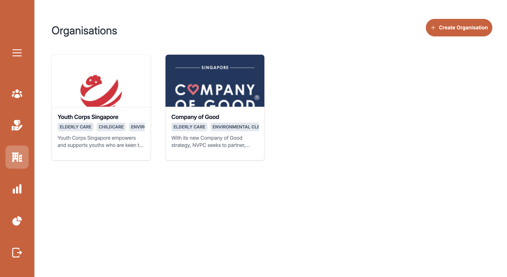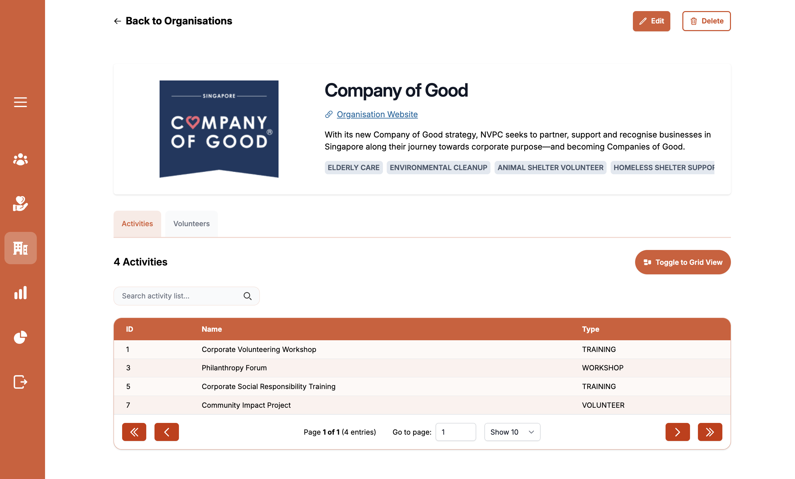

#### Volunteer Activity Report
This feature allows admins to analyse volunteer activity by
- viewing visual reports generated by volunteer activity by volunteer or hour across a timeline for different interest areas
- exporting these reports as a excel file
- using the search bar to look for volunteers by their name or email

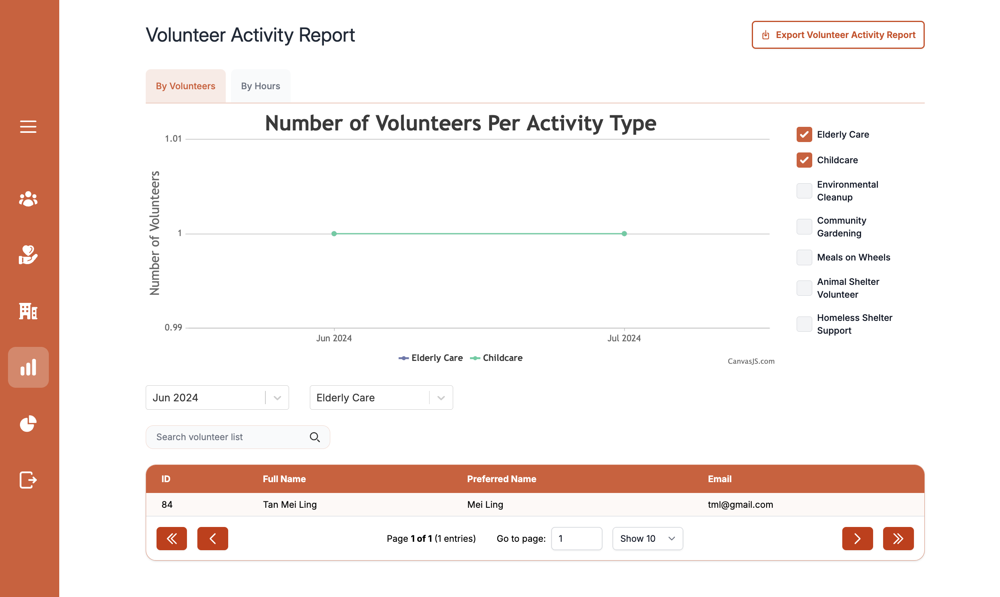


#### Volunteer Demographic Report
This feature allows admins to analyse volunteer demographic information by
- viewing visual reports generated by grouping volunteers by their age, gender, immigration status, skills, interests
- exporting these reports as a excel file
- using the search bar to look for volunteers by their name or email
- filtering the volunteer list of a specific view by their sub-categories e.g. (selecting Gender as the main view and male as the sub-category)

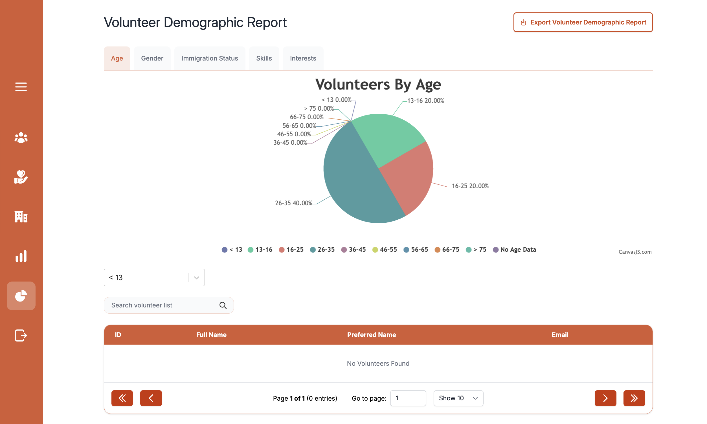

## Contributing

Contributions are welcome! Please follow these steps:

1. Fork the repository
2. Create your feature branch (git checkout -b feature-name)
3. Commit your changes (git commit -am 'Add some feature')
4. Push to the branch (git push origin feature-name)
5. Create a new Pull Request

## Installation

1. Move to a directory you want to store the project:
   ```sh
   cd [path to folder you want to store the project]
    ```
2. Clone the repository
    ```sh
    git clone https://github.com/seelengxd/h4g-2024.git
    ```
3. Once the project is done cloning, go to the project-directory
   ```sh
   cd [project-directory]
   ```
4. Install the dependencies for frontend and backend seperately
   - Navigate to backend and type into your command prompt
        ```sh
        cd backend
        npm install
        ```

   - Return to root directory and do the same for frontend
        ```sh
        cd frontend
        npm install
        ```
5. Setting up your environment
   - For the GMAIL environment variables, please set up your own via:
     - [Gmail App Password Setup](https://stackoverflow.com/questions/45478293/username-and-password-not-accepted-when-using-nodemailer)
     - [SGid Client Setup](https://id.gov.sg/)
    
6. Running the project
   - Open 2 command prompts
   - Navigate to backend and run `npm run dev`
   - In another command prompt, navigate to frontend and run `npm start`


### Technologies
We built this project with:
- Design: `Figma`
- Frontend: `React`, `Redux`, `Formik`, `TailwindCSS`, `CanvasJS`, `XLSX-renderer`
- Backend: `Express`, `Prisma`, `PDFLib`
- Deployment: `Nginx`, `DigitalOcean`

### Credits
List of Contributors:
- [@seelengxd](https://github.com/seelengxd)
- [@chloeelim](https://github.com/chloeelim)
- [@zichen-3974](https://github.com/zichen-3974)
- [@rachelNgiam]()